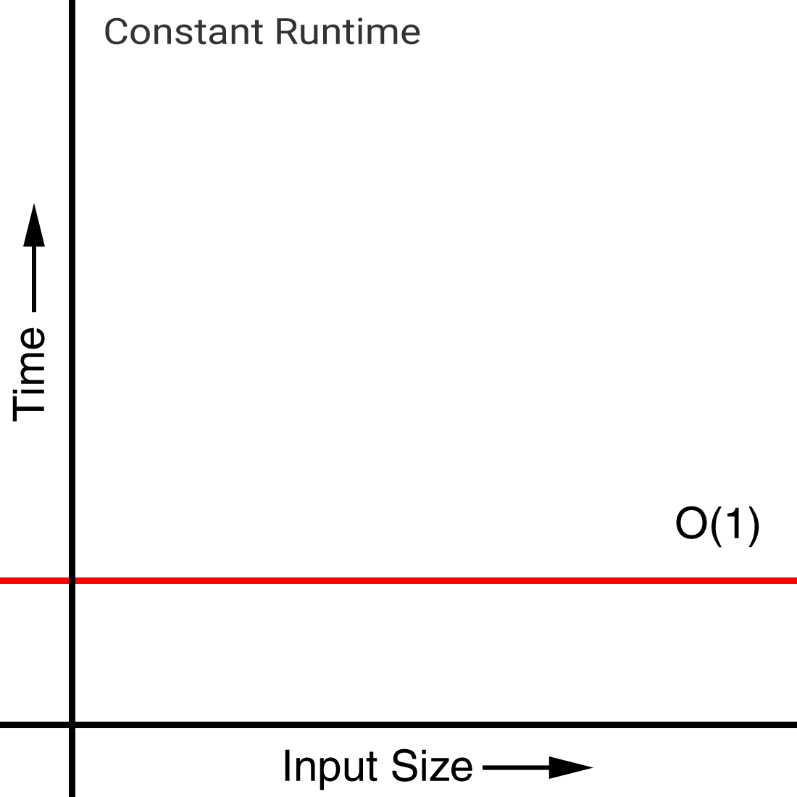
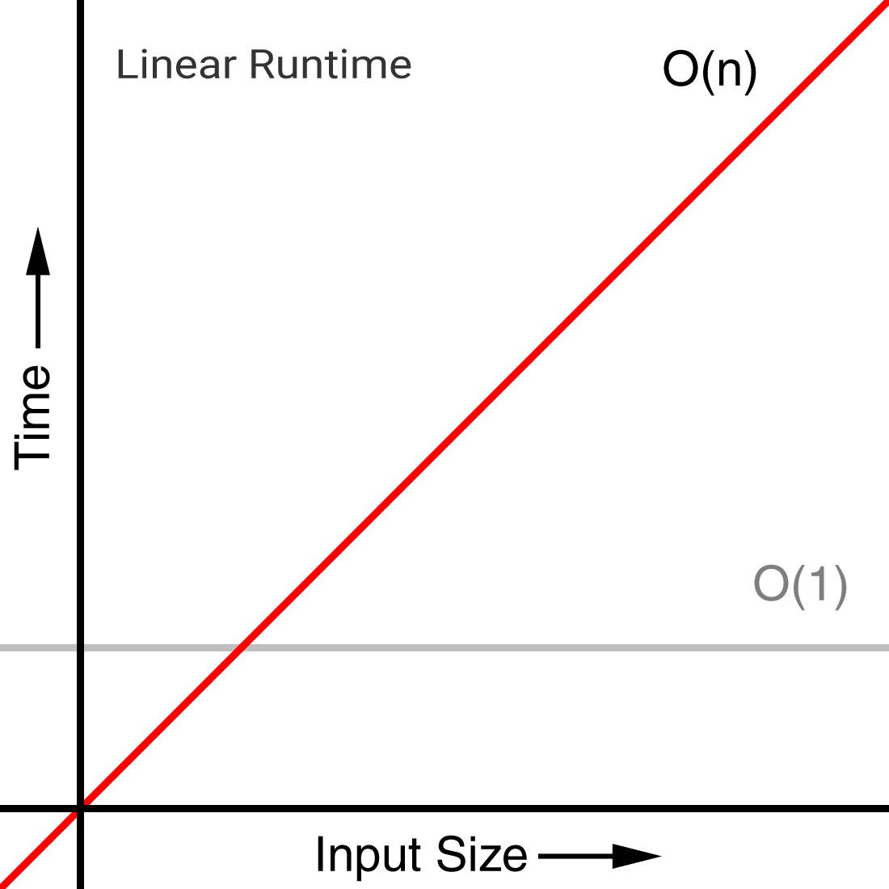
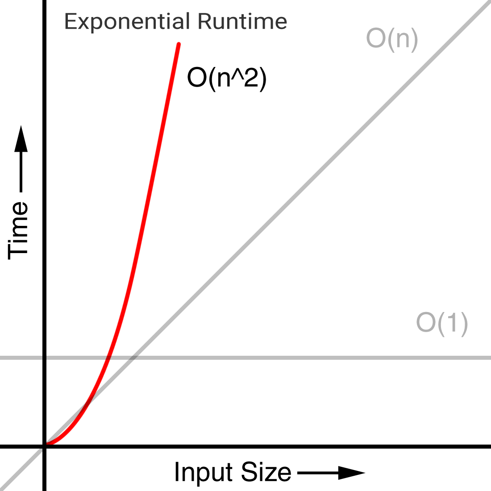
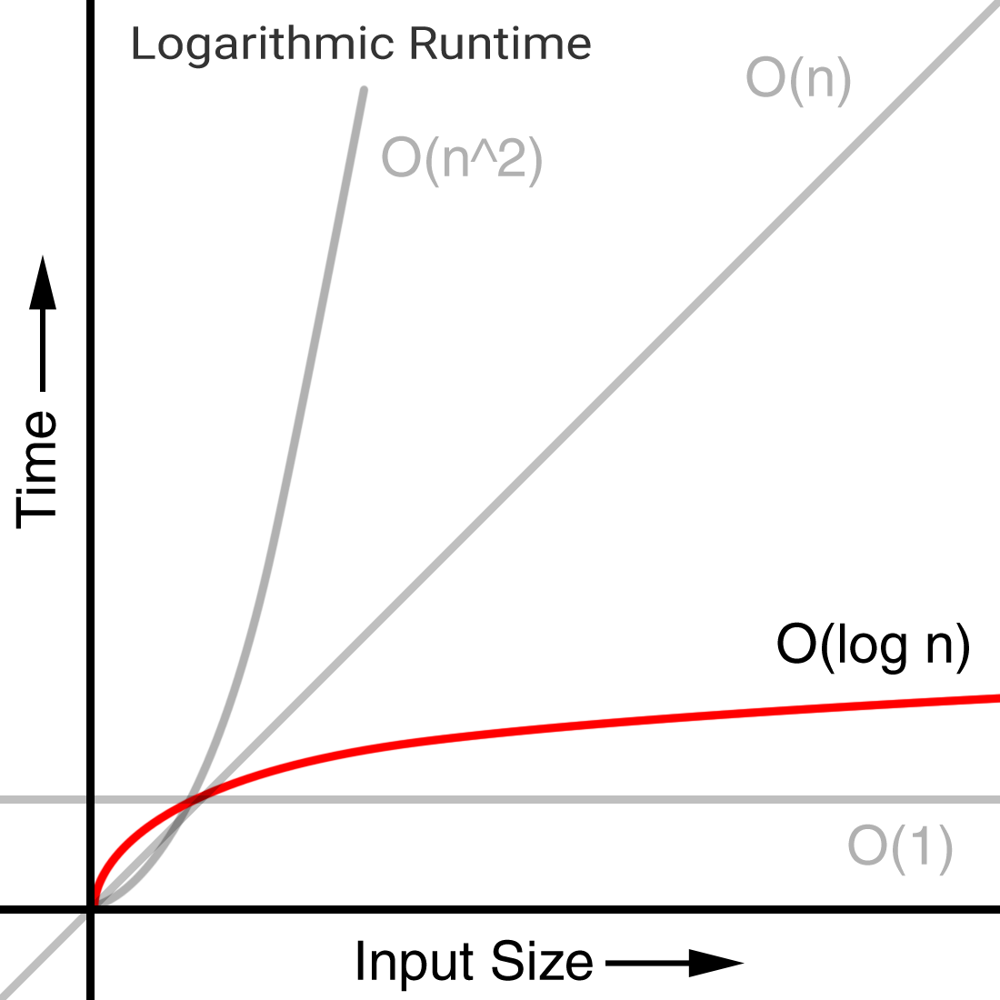

## Big 'O' Notation

### Notation: 'O (1)'

Regardless of input the following function will only ever return 2 indexes. The time will therefore be constant.

```js
// Constant Runtime
// Big O Notation: 'O (1)'
function log(array) {
  console.log(array[0])
  console.log(array[1])
}
```



<br><br>

### Notation: 'O (n)'

Runtime of the following function increases proportionally to our given input.

```js
// Linear Runtime
// Big O Notation: 'O (n)'
function logAll(input) {
  for (var i = 0, len = input.length; i < len; i += 1) {
    console.log(input[i])
  }
}

logAll([1, 2, 3])
logAll([1, 2, 3, 4, 5, 6]) // double the time
```
<br>


<br><br>

### Notation: 'O (n^2)'

The nested loop in the following function increases it's runtime exponentially according to the given input.

```js
// Exponential Runtime
// Big O Notation: 'O (n^2)'
function concatAndLog (input) {
  var len = input.length

  for (var i = 0; i < len; i += 1) {
    for (var j = 0; j < len; j += 1) {
      console.log(`${input[i]}${input[j]}`)
    }
  }
}

concatAndLog(['A','B','C'])
// 9 pairs logged
// AA AB AC BA ... CB CC

concatAndLog(['A','B','C','D','E'])
// 25 pairs logged
// AA AB AC AD AE BA ... ED EE
```



<br><br>

### Notation: 'O (log n)'

An example of a logarithmic runtime is a binary search.

#### Alphabet search example:

If we were looking through the alphabet for the letter '**P**'. We could search ***sequentially*** from '**A**' to '**P**' a total of **16** steps.

A *more* perfomant solution would be a binary search, which works by halving the input for each step.

With a binary search, we would start with our 26 characters and look for the middle character

**ABCDEFGHIJKL<font color='red'>M</font>NOPQRSTUVWXYZ**

The middle character is '**M**' and '**P**' is higher up the alphabet

We throw away the lower letters and search through the remaining characters

**NOPQRS<span style='color: teal; text-decoration: underline'>T</span>UVWXYZ**

The middle character is '**T**' and this time '**P**' is lower in the alphabet

We now throw away the higher letters and search through the remaining characters

**NO<span style='color: red; text-decoration: underline'>P</span>QRS**

The middle character is '**P**' and we have our match — A total of 3 steps.

A numeric binary search code example

```js
// Logarithmic Runtime
// Big O Notation: 'O (log n)'
function binarySearch (array, key) {
  let low = 0
  let high = array.length - 1
  let mid
  let element

  while (low <= high) {
    mid = Math.floor((low + high) / 2)
    element = array[mid]
    if (element < key) {
      low = mid + 1
    } else if (element > key) {
      high = mid - 1
    } else {
      return `index ${mid} steps ${steps}`
    }
  }

  return -1
}

binarySearch(
  [1, 3, 5, 7, 11, 13, 17, 19, 23, 29, 31, 37, 41, 43, 47, 53, 59],
  13
)

// search 17 elements for number 13
// 3 steps
// step1: 23
// step2: 7
// step3: 13

```


