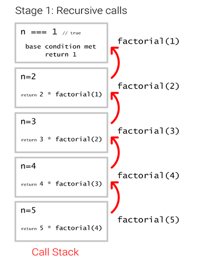
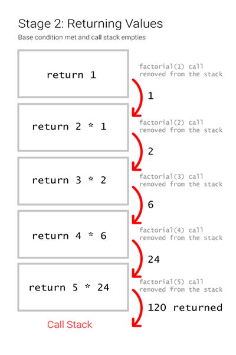

## Recursion

### Factorial example

```js
const factorial = n =>
  n === 1 // base condition
    ? n
    : n * factorial(n - 1)

// Test

console.log(factorial(5)) // 120
```
<br>
### 1. Call stack during calling phase

<br>
### 2. Call stack during return phase

